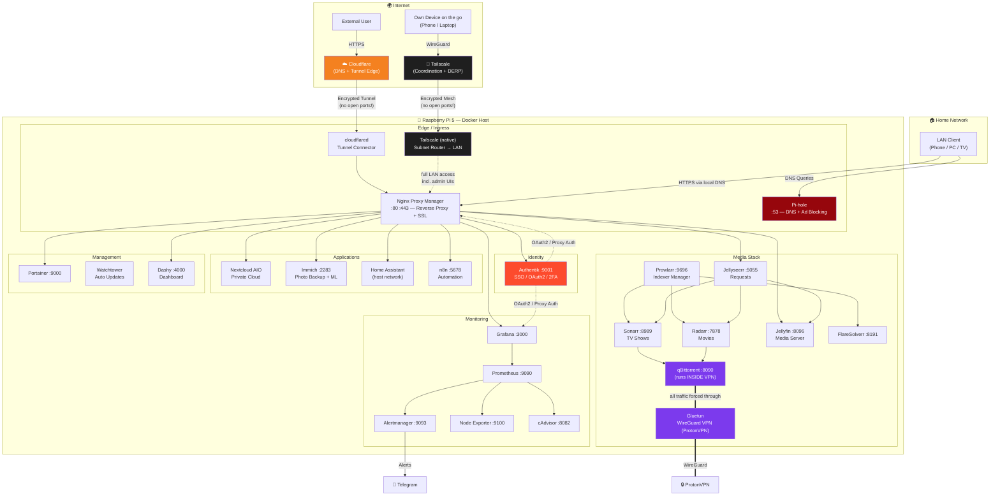

# 🏠 HomeLabSetup

> A complete, self-hosted home server stack running on a **Raspberry Pi 5** — media automation, private cloud, photo backup, smart home, SSO, and full monitoring. Everything containerized with Docker Compose.


---

## 📑 Table of Contents

- [Architecture](#-architecture)
- [Service Overview](#-service-overview)
- [Hardware & Storage](#-hardware--storage)
- [Quick Start](#-quick-start)
- [Service Setup Guides (Web UI)](#-service-setup-guides-web-ui)
  - [1. Nginx Proxy Manager](#1-nginx-proxy-manager--reverse-proxy)
  - [2. Pi-hole](#2-pi-hole--dns--ad-blocking)
  - [3. Cloudflared](#3-cloudflared--secure-external-access)
  - [4. Authentik](#4-authentik--sso--2fa)
  - [5. Portainer](#5-portainer--docker-management)
  - [6. Media Stack](#6-media-stack--jellyfin--arr--qbittorrent)
  - [7. Monitoring](#7-monitoring--grafana--prometheus--alertmanager)
  - [8. Immich](#8-immich--photo-backup)
  - [9. Nextcloud AIO](#9-nextcloud-aio--private-cloud)
  - [10. n8n](#10-n8n--workflow-automation)
  - [11. Home Assistant](#11-home-assistant--smart-home)
  - [12. Dashy](#12-dashy--dashboard)
  - [13. Tailscale](#13-tailscale--private-mesh-vpn)
- [Security Notes](#-security-notes)

---

## 🗺 Architecture

The diagram below follows the **C4 container-level style** (rendered with Mermaid, GitHub renders it natively). It shows how traffic flows from the internet and your LAN through the proxy layer into the individual services.



**Key design decisions:**

- 🔐 **Zero open ports** — external access goes exclusively through a Cloudflare Tunnel (public services) and Tailscale (private admin access). The router has no port forwarding at all.
- 🧭 **Two access tiers** — public apps (Jellyfin, Nextcloud, …) via Cloudflare Tunnel; admin UIs (Portainer, NPM, Prometheus, …) **only** via LAN or Tailscale.
- 🛡 **VPN-isolated torrenting** — qBittorrent shares Gluetun's network namespace (`network_mode: service:gluetun`). If the VPN drops, qBittorrent has **no** internet access (built-in kill switch).
- 🔑 **Single Sign-On** — Authentik provides OAuth2/OIDC for supported apps (e.g. Grafana) and 2FA in front of everything else.
- 📊 **Full observability** — every container and the host itself is scraped by Prometheus; alerts land in Telegram within minutes.

---

## 📦 Service Overview

| Service | Purpose | Port (internal) | Web UI |
|---|---|---|---|
| **Nginx Proxy Manager** | Reverse proxy + Let's Encrypt SSL | 80 / 443 / 81 | `http://<pi-ip>:81` |
| **Pi-hole** | Network-wide DNS ad blocking | 53 / 8081 | `http://<pi-ip>:8081/admin` |
| **Cloudflared** | Secure tunnel for external access | — | (Cloudflare Dashboard) |
| **Tailscale** | Mesh VPN + LAN subnet router (native, no Docker) | — | (Tailscale Admin Console) |
| **Authentik** | SSO, OAuth2, 2FA | 9001 | `http://<pi-ip>:9001` |
| **Portainer** | Docker management UI | 9000 / 9443 | `http://<pi-ip>:9000` |
| **Jellyfin** | Media streaming server | 8096 | `http://<pi-ip>:8096` |
| **Jellyseerr** | Media request management | 5055 | `http://<pi-ip>:5055` |
| **Sonarr** | TV show automation | 8989 | `http://<pi-ip>:8989` |
| **Radarr** | Movie automation | 7878 | `http://<pi-ip>:7878` |
| **Prowlarr** | Indexer management | 9696 | `http://<pi-ip>:9696` |
| **qBittorrent** | Download client (via VPN) | 8090 | `http://<pi-ip>:8090` |
| **FlareSolverr** | Cloudflare challenge solver | 8191 | (API only) |
| **Nextcloud AIO** | Private cloud (files, calendar, office) | 8080 (AIO) | `https://<pi-ip>:8080` |
| **Immich** | Photo/video backup with ML search | 2283 | `http://<pi-ip>:2283` |
| **Home Assistant** | Smart home hub | 8123 (host) | `http://<pi-ip>:8123` |
| **n8n** | Workflow automation | 5678 | `http://<pi-ip>:5678` |
| **Grafana** | Metric dashboards | 3000 | `http://<pi-ip>:3000` |
| **Prometheus** | Metrics collection | 9090 | `http://<pi-ip>:9090` |
| **Alertmanager** | Alert routing → Telegram | 9093 | `http://<pi-ip>:9093` |
| **Dashy** | Start page / service dashboard | 4000 | `http://<pi-ip>:4000` |
| **Watchtower** | Automatic container updates | — | — |

---

## 💾 Hardware & Storage

```
Raspberry Pi 5
├── /mnt/ssd/   →  SSD: Docker configs, databases, app state (fast, many small writes)
└── /mnt/hdd/   →  HDD: media library, downloads, Nextcloud files (bulk storage)
```

| Path | Used for |
|---|---|
| `/mnt/ssd/docker/<service>/` | Compose files + persistent config per service |
| `/mnt/hdd/media/movies` | Movie library (Radarr → Jellyfin) |
| `/mnt/hdd/media/tv` | TV library (Sonarr → Jellyfin) |
| `/mnt/hdd/media/downloads` | qBittorrent download target |
| `/mnt/hdd/nextcloud-external` | Nextcloud external storage |
| `/opt/immich/library` | Immich photo originals |

> 💡 **Why split SSD/HDD?** Databases (Postgres for Authentik, Immich, n8n) hate slow random I/O — they live on the SSD. Big sequential media files don't care — they live on the cheap HDD.

---

## 🚀 Quick Start

```bash
# 1. Clone
git clone https://github.com/jankln/HomeLabSetup.git
cd HomeLabSetup

# 2. For every service you want: create your .env from the example
cd <service>
cp .env.example .env
nano .env          # fill in YOUR passwords/keys — see comments inside

# 3. Start it
docker compose up -d

# 4. Check it's running
docker compose ps
```

**Recommended startup order** (later services depend on earlier ones):

1. `npm` → 2. `pihole` → 3. `cloudflared` → 4. `authentik` → 5. `portainer` → 6. everything else

Generate strong secrets with:

```bash
openssl rand -base64 36    # passwords / secret keys
openssl rand -hex 32       # n8n encryption key
```

---

## 🛠 Service Setup Guides (Web UI)

The compose files get the containers running — but most services need a few clicks in their web UI to actually work together. This is the part most guides skip. Here it is.

### 1. Nginx Proxy Manager — Reverse Proxy

**First login:** `http://<pi-ip>:81` → default credentials `admin@example.com` / `changeme` → you're forced to change them immediately.

**For every service you want under a nice domain:**

1. **Hosts → Proxy Hosts → Add Proxy Host**
2. *Domain Names:* e.g. `jellyfin.yourdomain.com`
3. *Scheme:* `http`, *Forward Hostname:* `<pi-ip>` (or the container name if on the same Docker network), *Forward Port:* e.g. `8096`
4. Enable **Block Common Exploits** and **Websockets Support** (needed for Jellyfin, Home Assistant, n8n!)
5. Tab **SSL** → *Request a new SSL Certificate* → enable **Force SSL** + **HTTP/2**

> ⚠️ For **Home Assistant** you must also add `use_x_frame_options` / trusted proxy config in its `configuration.yaml`, otherwise logins fail behind a proxy.

### 2. Pi-hole — DNS + Ad Blocking

**First login:** `http://<pi-ip>:8081/admin` with the password from your `.env`.

1. **Settings → DNS** → choose upstream servers (e.g. Cloudflare `1.1.1.1` or Quad9 `9.9.9.9`)
2. **Local DNS → DNS Records** → add an A-record per subdomain: `jellyfin.yourdomain.com → <pi-ip>`. This makes your domains resolve **locally** so LAN traffic never leaves the house.
3. **Adlists** → add block lists (e.g. the defaults + [firebog.net](https://firebog.net) "ticked" lists) → then **Tools → Update Gravity**
4. **In your router:** set the Pi's IP as the only DHCP DNS server — now every device in the house is ad-filtered automatically.

### 3. Cloudflared — Secure External Access

All configuration happens in the **Cloudflare Zero Trust Dashboard** (the container just needs the token):

1. [one.dash.cloudflare.com](https://one.dash.cloudflare.com) → **Networks → Tunnels → Create a tunnel** → type *Cloudflared*
2. Copy the token into `cloudflared/.env` → `docker compose up -d`
3. The tunnel shows **HEALTHY** once connected
4. **Public Hostname** tab → add one entry per service:
   - *Subdomain:* `jellyfin`, *Domain:* `yourdomain.com`
   - *Service:* `http://<pi-ip>:8096` — or point **everything** at NPM (`https://<pi-ip>:443`) and let NPM route it
5. Optional but recommended: **Access → Applications** → put a Cloudflare Access policy (email OTP / SSO) in front of admin UIs.

> 🔒 This is why the router needs **zero** open ports: cloudflared dials *out* to Cloudflare and keeps the connection alive.

### 4. Authentik — SSO / 2FA

**First setup:** go to `http://<pi-ip>:9001/if/flow/initial-setup/` ← note the special URL! Set the `akadmin` password there.

**Connect an app via OAuth2 (example: Grafana):**

1. **Applications → Providers → Create** → *OAuth2/OpenID Provider*
   - Redirect URI: `https://monitor.yourdomain.com/login/generic_oauth`
   - Note the **Client ID** and **Client Secret**
2. **Applications → Applications → Create** → name it `Grafana`, select the provider
3. Put Client ID/Secret into `monitoring/.env` → restart Grafana
4. Login page now shows **"Sign in with Authentik"** ✨

**Enforce 2FA:** **Flows & Stages → Flows** → edit the authentication flow → add a TOTP/WebAuthn stage. Every user is prompted to enroll on next login.

### 5. Portainer — Docker Management

1. `http://<pi-ip>:9000` → create the admin account **within 5 minutes** of first start (it locks itself otherwise — just `docker restart portainer` if that happens)
2. Choose **Get Started** → manages the local Docker socket
3. You now see all stacks, containers, logs, and consoles in one UI.

### 6. Media Stack — Jellyfin + *arr + qBittorrent

This is a chain — configure it in this order:

**a) qBittorrent** (`http://<pi-ip>:8090`)
- First password: check the container log → `docker logs qbittorrent` shows a temporary password
- **Settings → WebUI** → set your own password
- **Settings → Downloads** → Default Save Path: `/downloads`
- Verify the VPN works: `docker exec gluetun wget -qO- ifconfig.me` → must show a **ProtonVPN IP**, not yours!

**b) Prowlarr** (`http://<pi-ip>:9696`) — the indexer hub
- **Indexers → Add Indexer** → add your torrent indexers
- For Cloudflare-protected indexers: **Settings → Indexers → Add FlareSolverr** → `http://<pi-ip>:8191`
- **Settings → Apps** → add Sonarr (`http://<pi-ip>:8989` + its API key) and Radarr (`http://<pi-ip>:7878` + API key) → Prowlarr now syncs all indexers to both automatically

**c) Sonarr** (`http://<pi-ip>:8989`) **& Radarr** (`http://<pi-ip>:7878`)
- API key is under **Settings → General**
- **Settings → Download Clients → Add → qBittorrent** → host `<pi-ip>`, port `8090`
- **Settings → Media Management** → Root folder: `/tv` (Sonarr) / `/movies` (Radarr)
- Enable **Rename Episodes/Movies** for a clean library

**d) Jellyfin** (`http://<pi-ip>:8096`)
- Setup wizard → create admin → **Add Media Library**: type *Shows* → `/tv`, type *Movies* → `/movies`
- **Dashboard → Playback** → enable hardware transcoding if available

**e) Jellyseerr** (`http://<pi-ip>:5055`)
- Sign in **with your Jellyfin account** → import Jellyfin libraries
- Connect Sonarr + Radarr (URL + API key, set quality profile + root folder)
- Done: users request a movie in Jellyseerr → Radarr grabs it → qBittorrent downloads through the VPN → it appears in Jellyfin. **Fully automatic.** 🎬

### 7. Monitoring — Grafana / Prometheus / Alertmanager

**Grafana** (`http://<pi-ip>:3000`, admin password from `.env`):

1. The Prometheus datasource is **auto-provisioned** (see `monitoring/provisioning/`) — nothing to do
2. **Dashboards → Import** → these IDs cover everything:
   - `1860` — Node Exporter Full (host: CPU, RAM, disk, temperature)
   - `14282` — cAdvisor (per-container resources)
3. Optional: hook up Authentik SSO (see [section 4](#4-authentik--sso--2fa))

**Alertmanager → Telegram:**

1. Create a bot: message [@BotFather](https://t.me/BotFather) → `/newbot` → copy the **token**
2. Get your chat ID: message [@userinfobot](https://t.me/userinfobot)
3. Put both into `monitoring/alertmanager/alertmanager.yml` → `docker compose restart alertmanager`
4. Test: `docker stop jellyfin` → within ~2 minutes Telegram pings you. (`docker start jellyfin` 😉)

Included alert rules: host down, CPU > 90 %, RAM > 90 %, disk > 85 %/95 %, Pi temperature > 75 °C/82 °C, restart loops, OOM kills, and a missing-container alert for every important service.

### 8. Immich — Photo Backup

1. `http://<pi-ip>:2283` → create the admin account
2. Install the **Immich mobile app** (iOS/Android) → server URL: `https://photos.yourdomain.com` → enable auto backup
3. **Administration → Settings → Machine Learning** — smart search & face recognition work out of the box (the ML container handles it; first indexing run takes a while on a Pi)
4. Map external libraries if you have existing photo folders.

### 9. Nextcloud AIO — Private Cloud

1. Open `https://<pi-ip>:8080` (the **AIO master container**)
2. It shows a one-time passphrase → **save it** — it's your AIO admin login
3. Enter your domain (`cloud.yourdomain.com`) — AIO validates it must already resolve to the server (via NPM/Cloudflared)
4. Select optional components (Collabora office, whiteboard, …) → **Start containers**
5. AIO downloads, configures, and health-checks the whole Nextcloud suite automatically, including **built-in backups** (set a backup target in the AIO UI!)

### 10. n8n — Workflow Automation

1. `https://n8n.yourdomain.com` → create owner account
2. Workflows talk to anything: webhooks, Telegram, the *arr APIs, Home Assistant, …
3. ⚠️ The `N8N_ENCRYPTION_KEY` in `.env` encrypts stored credentials — **lose it and all saved credentials are unrecoverable.** Back it up.

### 11. Home Assistant — Smart Home

1. `http://<pi-ip>:8123` → onboarding wizard (account, location, units)
2. **Settings → Devices & Services** — integrations on your network are auto-discovered
3. For access through NPM, add to `configuration.yaml`:

```yaml
http:
  use_x_forwarded_for: true
  trusted_proxies:
    - 172.16.0.0/12    # Docker network range
```

### 12. Dashy — Dashboard

The config lives in `dashy/conf.yml` — edit it, replace `yourdomain.com` with your domain, restart the container. Built-in status checks ping every service and show a green/red dot. Set it as your browser start page. 🏁

### 13. Tailscale — Private Mesh VPN

The only service that runs **natively on the host** instead of Docker — as a subnet router it needs the host network stack directly. Full guide in [`tailscale/README.md`](tailscale/README.md); the short version:

```bash
# Install + enable IP forwarding, then:
sudo tailscale up --advertise-routes=192.168.178.0/24   # your LAN subnet
```

1. Authenticate via the printed login URL (no auth key ever touches the disk)
2. [Admin console](https://login.tailscale.com/admin/machines) → the Pi → **Edit route settings** → approve the subnet route → disable key expiry
3. Install the app on phone/laptop → you can now reach **every** LAN device from anywhere — this is the *only* way the admin UIs (Portainer, NPM, Prometheus, …) are reachable from outside
4. Bonus: add the Pi's Tailscale IP as DNS server in the admin console → Pi-hole ad blocking everywhere you go

---

## 🔐 Security Notes

- ✅ **No secrets in this repo** — every credential lives in a gitignored `.env`; each service ships a documented `.env.example`
- ✅ **No open router ports** — public traffic via Cloudflare Tunnel, private/admin traffic via Tailscale; both connect outbound only
- ✅ **Admin UIs never public** — Portainer, NPM, Prometheus & co. are reachable exclusively over LAN or Tailscale
- ✅ **Kill-switch torrenting** — qBittorrent can physically only reach the internet through the VPN container
- ✅ **SSO + 2FA** via Authentik in front of sensitive UIs
- ✅ **Alerting** — if anything dies, Telegram knows before you do
- ⚠️ Keep host SSH key-based and disable password auth: `PasswordAuthentication no` in `/etc/ssh/sshd_config`
- ⚠️ Watchtower auto-updates all images — convenient, but pin versions for critical services if you prefer stability over freshness

---

## 📄 License

[MIT](LICENSE) — do whatever you want with it. If it helps you build your own lab, even better. 🚀
